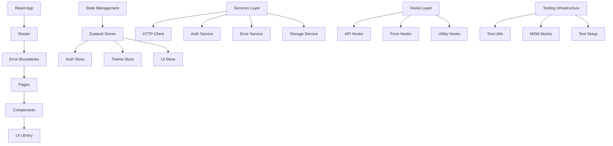

# Design Document

## Overview

This design outlines the comprehensive enhancement of the React project boilerplate to create a production-ready template with working tests, modern development practices, and robust error handling. The enhanced boilerplate will serve as a high-quality foundation for React applications with TypeScript, providing developers with a complete toolkit for rapid development.

## Architecture

### Core Architecture Principles

1. **Layered Architecture**: Clear separation between presentation, business logic, and data layers
2. **Dependency Injection**: Services and utilities injected through React context and custom hooks
3. **Type Safety**: Comprehensive TypeScript coverage with strict type checking
4. **Error Boundaries**: Hierarchical error handling with graceful degradation
5. **Performance First**: Optimized bundle splitting, lazy loading, and memoization strategies

### System Components



## Components and Interfaces

### 1. Test Infrastructure Enhancement

#### Test Environment Configuration
```typescript
// vitest.config.ts enhancement
interface TestConfig {
  environment: 'jsdom';
  setupFiles: string[];
  globals: boolean;
  coverage: CoverageConfig;
}

// Test setup utilities
interface TestUtils {
  renderWithProviders: (component: ReactElement, options?: RenderOptions) => RenderResult;
  createMockUser: () => User;
  createMockApiResponse: <T>(data: T) => ApiResponse<T>;
  waitForLoadingToFinish: () => Promise<void>;
}
```

#### Browser API Mocks
```typescript
// Global mocks for browser APIs
interface BrowserMocks {
  localStorage: Storage;
  sessionStorage: Storage;
  window: Window & typeof globalThis;
  navigator: Navigator;
  fetch: typeof fetch;
}
```

### 2. Enhanced Error Handling System

#### Error Service Architecture
```typescript
interface ErrorService {
  handleError(error: Error | string, options?: ErrorOptions): void;
  handleApiError(error: ApiError, options?: ErrorOptions): void;
  handleNetworkError(error: NetworkError, options?: ErrorOptions): void;
  handleValidationError(message: string, field?: string): void;
  getStoredErrors(): StoredError[];
  clearStoredErrors(): void;
}

interface ErrorOptions {
  severity?: 'low' | 'medium' | 'high' | 'critical';
  showToast?: boolean;
  context?: Record<string, any>;
  silent?: boolean;
}

interface ToastService {
  show(message: string, type: ToastType, options?: ToastOptions): void;
  success(message: string, options?: ToastOptions): void;
  error(message: string, options?: ToastOptions): void;
  warning(message: string, options?: ToastOptions): void;
  info(message: string, options?: ToastOptions): void;
}
```

### 3. UI Component Library

#### Core Component Interfaces
```typescript
// Base component props
interface BaseComponentProps {
  className?: string;
  children?: React.ReactNode;
  testId?: string;
}

// Form components
interface InputProps extends BaseComponentProps {
  label: string;
  type?: 'text' | 'email' | 'password' | 'number';
  value?: string;
  onChange?: (value: string) => void;
  error?: string;
  required?: boolean;
  disabled?: boolean;
  placeholder?: string;
}

interface ButtonProps extends BaseComponentProps {
  variant?: 'primary' | 'secondary' | 'outline' | 'ghost' | 'danger';
  size?: 'small' | 'medium' | 'large';
  loading?: boolean;
  disabled?: boolean;
  onClick?: () => void;
  type?: 'button' | 'submit' | 'reset';
}

// Feedback components
interface ToastProps {
  id: string;
  message: string;
  type: 'success' | 'error' | 'warning' | 'info';
  duration?: number;
  onClose: () => void;
}

interface ModalProps extends BaseComponentProps {
  isOpen: boolean;
  onClose: () => void;
  title?: string;
  size?: 'small' | 'medium' | 'large' | 'fullscreen';
}
```

### 4. State Management Enhancement

#### Store Architecture
```typescript
// Enhanced app store with proper typing
interface AppStore {
  // User state
  user: User | null;
  setUser: (user: User | null) => void;
  
  // Theme state
  theme: 'light' | 'dark' | 'system';
  setTheme: (theme: 'light' | 'dark' | 'system') => void;
  
  // UI state
  loading: Record<string, boolean>;
  setLoading: (key: string, loading: boolean) => void;
  
  // Toast state
  toasts: Toast[];
  addToast: (toast: Omit<Toast, 'id'>) => void;
  removeToast: (id: string) => void;
}

// API state management
interface ApiState<T> {
  data: T | null;
  loading: boolean;
  error: string | null;
  lastFetch: Date | null;
}
```

### 5. Authentication System

#### Auth Service Design
```typescript
interface AuthService {
  login(credentials: LoginCredentials): Promise<AuthResponse>;
  logout(): Promise<void>;
  refreshToken(): Promise<string>;
  getCurrentUser(): Promise<User>;
  isAuthenticated(): boolean;
  hasRole(role: string): boolean;
  getToken(): string | null;
}

interface AuthGuard {
  requireAuth: (component: React.ComponentType) => React.ComponentType;
  requireRole: (role: string) => (component: React.ComponentType) => React.ComponentType;
}
```

### 6. Form Management System

#### Form Hook Design
```typescript
interface UseFormOptions<T> {
  initialValues: T;
  validationSchema?: ValidationSchema<T>;
  onSubmit: (values: T) => Promise<void> | void;
}

interface UseFormReturn<T> {
  values: T;
  errors: Partial<Record<keyof T, string>>;
  touched: Partial<Record<keyof T, boolean>>;
  isSubmitting: boolean;
  isValid: boolean;
  handleChange: (field: keyof T, value: any) => void;
  handleBlur: (field: keyof T) => void;
  handleSubmit: (e: React.FormEvent) => void;
  resetForm: () => void;
  setFieldError: (field: keyof T, error: string) => void;
}
```

## Data Models

### Core Data Types
```typescript
// User model
interface User {
  id: string;
  name: string;
  email: string;
  role: 'admin' | 'user' | 'moderator';
  avatar?: string;
  isActive: boolean;
  emailVerified: boolean;
  createdAt: string;
  updatedAt: string;
}

// API response wrapper
interface ApiResponse<T> {
  data: T;
  message: string;
  success: boolean;
  errors?: ValidationError[];
}

// Error models
interface StoredError {
  id: string;
  message: string;
  type: 'runtime' | 'api' | 'network' | 'validation';
  severity: 'low' | 'medium' | 'high' | 'critical';
  timestamp: string;
  context?: Record<string, any>;
}
```

## Error Handling

### Error Boundary Strategy
```typescript
// Hierarchical error boundaries
interface ErrorBoundaryProps {
  fallback?: React.ComponentType<ErrorFallbackProps>;
  onError?: (error: Error, errorInfo: ErrorInfo) => void;
  isolate?: boolean; // Prevent error propagation
}

// Error fallback components
interface ErrorFallbackProps {
  error: Error;
  resetError: () => void;
  errorId: string;
}
```

### Error Recovery Mechanisms
1. **Automatic Retry**: Network errors with exponential backoff
2. **Graceful Degradation**: Fallback UI for non-critical failures
3. **User Feedback**: Clear error messages with actionable steps
4. **Error Reporting**: Structured logging for debugging

## Testing Strategy

### Test Categories and Coverage
1. **Unit Tests**: Individual components and utilities (>90% coverage)
2. **Integration Tests**: Component interactions and data flow
3. **E2E Tests**: Critical user journeys with Playwright
4. **Accessibility Tests**: Automated a11y testing with jest-axe
5. **Visual Regression**: Component visual consistency

### Testing Utilities
```typescript
// Enhanced test utilities
interface TestingUtils {
  // Rendering utilities
  renderWithProviders: (component: ReactElement) => RenderResult;
  renderWithRouter: (component: ReactElement, route?: string) => RenderResult;
  
  // Mock utilities
  createMockUser: (overrides?: Partial<User>) => User;
  createMockApiResponse: <T>(data: T) => ApiResponse<T>;
  
  // Interaction utilities
  waitForLoadingToFinish: () => Promise<void>;
  fillForm: (form: HTMLFormElement, data: Record<string, string>) => Promise<void>;
  
  // Assertion utilities
  expectToastMessage: (message: string) => void;
  expectLoadingState: (element: HTMLElement) => void;
}
```

### MSW Integration
```typescript
// API mocking with MSW
interface MockApiHandlers {
  auth: {
    login: RestHandler;
    logout: RestHandler;
    refresh: RestHandler;
    me: RestHandler;
  };
  users: {
    list: RestHandler;
    get: RestHandler;
    create: RestHandler;
    update: RestHandler;
    delete: RestHandler;
  };
}
```

## Performance Optimizations

### Code Splitting Strategy
1. **Route-based splitting**: Each page as separate chunk
2. **Component-based splitting**: Heavy components loaded on demand
3. **Vendor splitting**: Third-party libraries in separate bundles
4. **Dynamic imports**: Feature-based code splitting

### Optimization Techniques
```typescript
// Performance monitoring
interface PerformanceMetrics {
  bundleSize: number;
  loadTime: number;
  renderTime: number;
  memoryUsage: number;
}

// Optimization utilities
interface OptimizationUtils {
  lazyLoad: <T>(importFn: () => Promise<{ default: T }>) => React.LazyExoticComponent<T>;
  memoize: <T extends (...args: any[]) => any>(fn: T) => T;
  debounce: <T extends (...args: any[]) => any>(fn: T, delay: number) => T;
  throttle: <T extends (...args: any[]) => any>(fn: T, limit: number) => T;
}
```

## Development Experience

### Developer Tools Integration
1. **React DevTools**: Enhanced debugging with proper component names
2. **Redux DevTools**: State management debugging for Zustand
3. **TypeScript**: Strict type checking with helpful error messages
4. **ESLint/Prettier**: Consistent code formatting and quality
5. **Husky**: Pre-commit hooks for quality gates

### Documentation Strategy
1. **README**: Comprehensive setup and usage guide
2. **Component Docs**: Storybook with interactive examples
3. **API Docs**: TypeScript interfaces with JSDoc comments
4. **Architecture Guide**: System design and patterns explanation
5. **Contributing Guide**: Development workflow and standards

## Deployment and Distribution

### Template Preparation
```typescript
// Template configuration
interface TemplateConfig {
  projectName: string;
  description: string;
  author: string;
  repository: string;
  license: string;
}

// Setup script
interface SetupScript {
  replaceTemplateValues: (config: TemplateConfig) => void;
  initializeGit: () => void;
  installDependencies: () => void;
  runInitialTests: () => void;
}
```

### Distribution Strategy
1. **GitHub Template**: One-click project creation
2. **NPX Script**: Command-line project generator
3. **Docker Image**: Containerized development environment
4. **Documentation Site**: Comprehensive usage guide

This design provides a comprehensive foundation for enhancing the React boilerplate into a production-ready template that developers can confidently use for new projects.